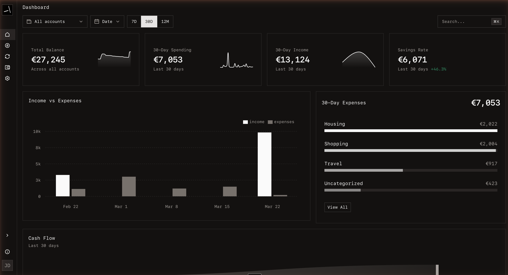

<p align="center">
  <h1 align="center"><b>Syllogic</b></h1>
  <p align="center">
    Self-hosted personal finance dashboard with AI categorization, recurring spend tracking, and a live demo.
    <br />
    <br />
    <a href="https://app.syllogic.ai/login?demo=1&utm_source=github&utm_medium=readme&utm_campaign=oss_promotion&utm_content=hero_demo">Live Demo</a>
    ·
    <a href="START_HERE.md">Start Here</a>
    ·
    <a href="#quick-start">Self-Host</a>
    ·
    <a href="ROADMAP.md">Roadmap</a>
    ·
    <a href="https://github.com/syllogic-ai/syllogic/discussions">Discussions</a>
  </p>
</p>

<p align="center">
  <a href="LICENSE">
    
  </a>
  <a href="https://github.com/orgs/syllogic-ai/packages">
    
  </a>
  <a href="https://railway.com/deploy/N98lwA?referralCode=25KFsK&utm_source=github&utm_medium=readme&utm_campaign=oss_promotion&utm_content=hero_railway">
    
  </a>
</p>



## About Syllogic

Syllogic is an open-source personal finance app for self-hosters who want control over their data without giving up a polished product. Track balances, spending, recurring charges, and trends, import and export CSVs, and optionally enable AI categorization.

## Why self-hosters care

- Keep financial data on infrastructure you control
- Start with Docker, Railway, or CasaOS instead of building from scratch
- Export your data whenever you want
- Use AI categorization only if it helps your workflow

## Try it now

- Live demo: [app.syllogic.ai/login?demo=1](https://app.syllogic.ai/login?demo=1&utm_source=github&utm_medium=readme&utm_campaign=oss_promotion&utm_content=top_demo)
- Quick guide: [START_HERE.md](START_HERE.md)
- Roadmap: [ROADMAP.md](ROADMAP.md)

## What works today

- **Balances and cash flow**: dashboard views, savings trends, and cash-flow breakdowns
- **AI categorization**: optional OpenAI-powered categorization with rule-based fallback
- **Recurring spend tracking**: identify subscriptions and recurring charges
- **Category analytics**: compare spending over time and spot trends
- **Transfer and reimbursement linking**: avoid double-counting across accounts
- **CSV import/export**: ingest bank exports and keep your data portable
- **MCP server**: connect compatible LLM clients for technical finance workflows

## Quick Start

### Self-Hosted (Docker)

**One-liner** (requires root, Docker, and Docker Compose):

```bash
curl -fsSL https://github.com/syllogic-ai/syllogic/releases/latest/download/install.sh | sudo bash
```

**Or manually:**

1. Clone and configure:

   **Linux/macOS:**
   ```bash
   git clone https://github.com/syllogic-ai/syllogic.git
   cd syllogic
   cp deploy/compose/.env.example deploy/compose/.env
   # Edit deploy/compose/.env — set POSTGRES_PASSWORD, BETTER_AUTH_SECRET, INTERNAL_AUTH_SECRET
   ```

   **Windows (PowerShell):**
   ```powershell
   git clone https://github.com/syllogic-ai/syllogic.git
   cd syllogic
   copy deploy\compose\.env.example deploy\compose\.env
   # Edit deploy\compose\.env — set POSTGRES_PASSWORD, BETTER_AUTH_SECRET, INTERNAL_AUTH_SECRET
   ```

2. Start:

   **Linux/macOS:**
   ```bash
   ./scripts/prod-up.sh
   ```

   **Windows (PowerShell or CMD):**
   ```powershell
   .\scripts\prod-up.bat
   ```

3. Open `http://localhost:8080` and create your account.

For advanced configuration (TLS, custom domains, MCP server), see [`deploy/compose/README.md`](deploy/compose/README.md).

### Railway (One-Click)

[](https://railway.com/deploy/N98lwA?referralCode=25KFsK&utm_source=github&utm_medium=readme&utm_campaign=oss_promotion&utm_content=quickstart_railway)

After deploy, set these **Shared Variables** in Railway:

- `POSTGRES_PASSWORD` (required)
- `BETTER_AUTH_SECRET` (required)
- `INTERNAL_AUTH_SECRET` (required)
- `DATA_ENCRYPTION_KEY_CURRENT` (recommended — field-level encryption)
- `DATA_ENCRYPTION_KEY_ID` (recommended — e.g. `k1`)
- `OPENAI_API_KEY` (optional — enables AI categorization)
- `LOGO_DEV_API_KEY` (optional — enables company logos)

For full Railway setup details, see [`deploy/railway/README.md`](deploy/railway/README.md).

### Shared Demo Login Link

For public demo environments, you can share a login URL that prefills demo credentials:

`https://your-app-domain.com/login?demo=1`

Syllogic public demo:

`https://app.syllogic.ai/login?demo=1`

Set these frontend environment variables on that deployment:

- `NEXT_PUBLIC_DEMO_EMAIL`
- `NEXT_PUBLIC_DEMO_PASSWORD`

Optional auth throttling (recommended for public demos):

- `AUTH_RATE_LIMIT_ENABLED=true`
- `AUTH_RATE_LIMIT_WINDOW_MS=60000`
- `AUTH_RATE_LIMIT_MAX_ATTEMPTS_PER_WINDOW=30`
- `DEMO_AUTH_RATE_LIMIT_MAX_ATTEMPTS_PER_WINDOW=10`
- `DEMO_AUTH_RATE_LIMIT_GLOBAL_MAX_ATTEMPTS_PER_WINDOW=120`

### Other Deployment Methods

| Method | Use case | Docs |
|--------|----------|------|
| CasaOS | Home lab / NAS users | [`deploy/casaos/`](deploy/casaos/README.md) |

## Configuration

| Variable | Description | Required |
|----------|-------------|----------|
| `POSTGRES_PASSWORD` | PostgreSQL password | Yes |
| `BETTER_AUTH_SECRET` | Auth session signing key | Yes |
| `INTERNAL_AUTH_SECRET` | App-to-backend signed auth | Yes |
| `DATA_ENCRYPTION_KEY_CURRENT` | Field-level encryption key | Recommended |
| `OPENAI_API_KEY` | AI transaction categorization | No |
| `LOGO_DEV_API_KEY` | Company logo lookup | No |

Generate secrets with `openssl rand -hex 32`. For encryption keys: `openssl rand -base64 32`.

### Optional Features Behavior

**`OPENAI_API_KEY`** — AI-powered categorization via OpenAI (GPT-4o-mini by default).
- **When set**: Transactions are categorized using the LLM for high accuracy.
- **When not set**: Falls back to keyword-based matching (e.g., "Tesco" → Groceries, "Netflix" → Entertainment). The keyword matcher uses a 70% confidence threshold.

**`LOGO_DEV_API_KEY`** — Company logo lookup via [logo.dev](https://logo.dev).
- **When set**: Merchant logos are fetched and displayed for transactions and accounts.
- **When not set**: No logos are shown; the feature is silently disabled.

Full variable reference is available in [`deploy/compose/.env.example`](deploy/compose/.env.example).

## Architecture

- Next.js 16+ (TypeScript, Drizzle ORM, BetterAuth, shadcn/ui, Recharts)
- FastAPI (SQLAlchemy 2.0, Celery + Redis, OpenAI)
- PostgreSQL 16, Redis 7, Docker Compose

Both services share a single PostgreSQL database. The frontend handles all CRUD via Server Actions; the backend handles data enrichment, bank sync, and background jobs.

### People & ownership

Syllogic models a household as a set of `people` belonging to one user. Accounts, properties, and vehicles can have one or more owners with optional shares (a `NULL` share means equal split). Holdings inherit ownership from their account. The Syllogic MCP read tools accept `person_ids` to scope results and attribute share-weighted amounts.

### Routines (weekly digest)

Users can define agentic Routines — scheduled prompts that run against the Syllogic MCP and produce React Email digests sent via Resend. The first template is a household investment-strategy review based on the audit prompt in `household-investment-strategy-risk-review.md`. A Celery Beat poller checks for due routines every 60 seconds.

Required env vars: `ANTHROPIC_API_KEY`, `RESEND_API_KEY`, `RESEND_FROM_EMAIL`, plus the existing `INTERNAL_AUTH_SECRET` for backend↔frontend HMAC.

### Investment plans

Configure a recurring monthly amount split into pinned (specific symbol) and discretionary (theme the agent picks from) slots. Each month a Celery-Beat poller fires the agent, which grounds itself in your real cash + last-30-day broker activity (via MCP) and returns per-slot verdicts plus a top-10 ranked list per discretionary theme. The "this month's suggested buys" card on the run-detail page lets you tick off trades as you place them in your broker manually — no order execution from this app.

## Development

Quick start for contributors:

### Option A: Prebuilt Mode (Recommended)

Everything runs in Docker using prebuilt images. Easiest setup for full-stack testing.

**1. Clone and configure:**

```bash
git clone https://github.com/syllogic-ai/syllogic.git
cd syllogic
cp deploy/compose/.env.example deploy/compose/.env
# Edit deploy/compose/.env — set INTERNAL_AUTH_SECRET, BETTER_AUTH_SECRET
# Keep DATABASE_URL=postgresql://...@postgres:5432/... (Docker internal)
```

**2. Start the stack:**

```bash
# Linux/macOS
./scripts/dev-up.sh --prebuilt

# Windows
.\scripts\dev-up.bat prebuilt
```

**3. Open http://localhost:8080**

### Option B: Local Mode

Infrastructure runs in Docker, frontend runs on host. Best for frontend development with hot reload.

**1. Clone and configure:**

```bash
git clone https://github.com/syllogic-ai/syllogic.git
cd syllogic
cp deploy/compose/.env.example deploy/compose/.env
# Edit deploy/compose/.env — set INTERNAL_AUTH_SECRET, BETTER_AUTH_SECRET
```

**2. Start infrastructure:**

```bash
# Linux/macOS
./scripts/dev-up.sh --local

# Windows
.\scripts\dev-up.bat local
```

This starts PostgreSQL, Redis, and Celery workers, installs dependencies, runs migrations, and creates `frontend/.env.local` with the required environment variables.

**3. Start the Next.js dev server:**

```bash
cd frontend
pnpm dev
```

**4. (Optional) Start the backend** (required for CSV import and other backend features):

```bash
cd backend
uvicorn app.main:app --reload
```

**5. Open http://localhost:3000**

> **Note:** Local mode runs only infrastructure. CSV import and other backend features require starting the backend (step 4) or using prebuilt mode.

See [CONTRIBUTING.md](CONTRIBUTING.md) for full setup instructions and code style guidelines.

## License

Licensed under the [GNU Affero General Public License v3.0](LICENSE) (AGPL-3.0).
